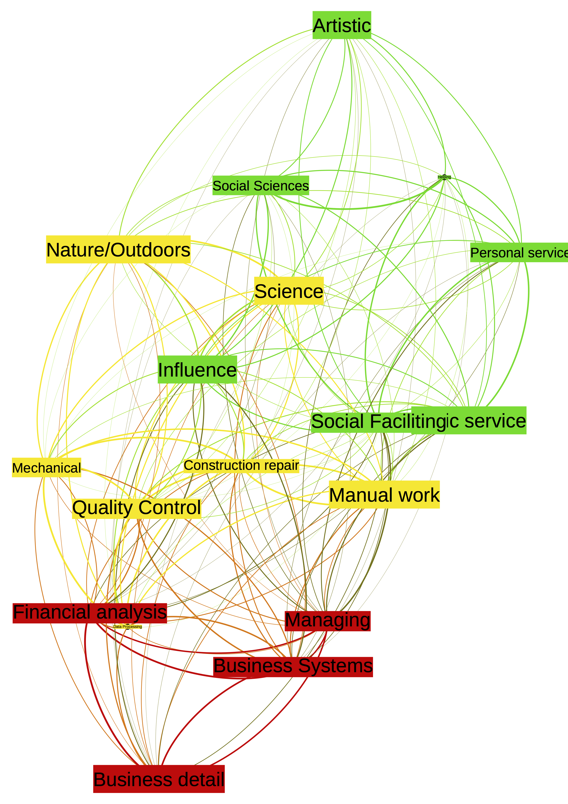

```{r setup, include=FALSE}
options(htmltools.dir.version = FALSE)
knitr::opts_chunk$set(echo = TRUE)
```

## A different type of talk.

```{r, out.width = "600px", echo=FALSE, fig.align='center'}
 
```

---

## A different type of talk.

* Introduction.

* What have I done thus far?

* What's on the horizon... .

* Q & A.


--

```{r, out.width = "300px", echo=FALSE, fig.align='center'}
knitr::include_graphics("https://upload.wikimedia.org/wikipedia/commons/thumb/e/e8/25th_CAB_trains_with_Navy_divers_130619-A-AB123-068.jpg/2880px-25th_CAB_trains_with_Navy_divers_130619-A-AB123-068.jpg") # See wikipedia for attribution.
```

---
## Who am I?

* Lic. in Sociology (Ghent)

* MSc. in Evolutionary Psychology (Liverpool)

* PhD in Psychology (Newcastle)

--
* Posts in Evolutionary/Social Psychology at Groningen, VU Amsterdam, Leiden.

--

* Now I am here. 

--

```{r, out.width = "300px", echo=FALSE, fig.align='center'}
knitr::include_graphics("https://media.giphy.com/media/98BKOjhIF4LPW/giphy.gif")
```

---
class: inverse
## Evolutionary psychology... .

* I use evolutionary psychology to study social relationships.

--

* Mostly mating preferences... .

--

* Also online... .

```{r, out.width = "400px", echo=FALSE, fig.align='center'}
knitr::include_graphics("https://static1.squarespace.com/static/5114c744e4b044f8ed62c985/t/58cb9d569de4bb4a04a18344/1489739190158/?format=1000w")
```


---
## Evolutionary Psychology

* Online dating --> Mostly as a tool.

--

* Replicate this paper.

--


```{r, out.width = "500px", echo=FALSE, fig.align='center'}

```

---
## Key findings of Kenrick et al.

Based on evolutionary psychology they derive the following predictions:

(a) younger heterosexual men will prefer women both younger and older than themselves, but older heterosexual men will only prefer women younger than themselves and specifically women in the fertile age range; 

(b) heterosexual women will prefer men older than themselves and show no preference for younger men; 

(c) homosexual men will demonstrate similar age preferences to those of heterosexual men; and 

(d) homosexual women will demonstrate a preference for both younger and older women.

---
## Coding of Guardian Soulmates profiles.

* N= 996

* Own Age, Min./Max. Age.

--


```{r, out.width = "580px", echo=FALSE, fig.align='center'}

```

---
## Key result.

```{r, out.width = "500px", echo=FALSE, fig.align='center'}

```
---
## Key findings.

* Both heterosexual and homosexual men prefer partners similar to their own age or younger, and with increasing age, relatively younger partners are preferred.

* In contrast, heterosexual women prefer partners similar to their own age or older, but at an older age younger partners are also accepted. Homosexual women prefer partners of a similar age, and with increasing age increasingly younger women are preferred.

--> By and large supports Kenrick et al. (1995).

**But**: The tolerance ranges for certain age preferences in our sample are larger than in Kenrick et al. study. Later for heterosexual men in our study. Larger overall age tolerances for homosexual preferences in our study.

---
## Probability of a match.


```{r, out.width = "600px", echo=FALSE, fig.align='center'}

```

---
## Online dating... .


* Other data from Guardian Soulmates --> Clustering. Do people have a specific preference? How does that relate to age profiles?

--

* Working with PhD student Lara Hallam (University of Antwerp) on trust in an online dating context.

```{r, out.width = "400px", echo=FALSE, fig.align='center'}
knitr::include_graphics("http://1mc8511ob3uc397k3v2p939j-wpengine.netdna-ssl.com/wp-content/uploads/2016/07/dating-meme.jpg")
```

---
class: inverse
## Something different... .

* Egocentric social networks and social media use.

```{r, out.width = "350px", echo=FALSE, fig.align='center'}
knitr::include_graphics("http://i0.kym-cdn.com/photos/images/original/000/671/961/e55.jpg")
```

---
## Social media and egocentric social networks.

* We had Sam Roberts here a while ago.

--

* Goal of project: costs and benefits of social media use (Facebook).

--

* Small scale survey, correlational study. 

--

* We found no significant relationship between facebook usage (yes/no , nr. of minutes) and offline network characteristics.

--

```{r, out.width = "400px", echo=FALSE, fig.align='center'}

```

---
## Follow-up
--

* This work was very basic. Follow-ups with experience sampling would be nice. 

--

* How do offline networks relate to online networks?

--

* Does this predict relevant outcomes (loneliness/achievement)?

--

* What is the role of personality?

--

---
## Other work.

--

* Birds of a feather locate together.

--

* Personality profiles of FourSquare Users.

--

* Key finding: No assortment for overall personality profile. Assortment for Openness to Experience and Conscientiousness.

```{r, out.width = "400px", echo=FALSE, fig.align='center'}

```

---
## Other work (MRes projects Amsterdam).

* Can people tell how 'groupy' their facebook network is. (R & R with _Social Science Research_).

--

* Personality, loneliness and egocentric facebook structures.

--

```{r, out.width = "400px", echo=FALSE, fig.align='center'}

```

---
## Future work.

* Benefits of social media might differ according to populations, also face-to-face versus other modes. 

--

* --> Would elderly populations benefit from Skype interactions? PhD project exploring this.

--

* How does social media usage specifically relate to loneliness at different social network layers?

--

* Social signatures in social networks. (cfr. talk by Sam Roberts)

---
class: inverse
## Something different, again... .

* Dr. Janneke Oostrom @ VU Amsterdam. 

* Project on Informal email addresses.

```{r, out.width = "400px", echo=FALSE, fig.align='center'}
knitr::include_graphics("https://media.giphy.com/media/GYJJQIUUuyEmY/giphy.gif")
```

---
## Informal email address study.

* luv_u_sanne@hotmail.com vs. sannejong@hotmail.com.

--

* small study (N=73) where recruiters evaluated CVs where email address was manipulated.

--

```{r, out.width = "600px", echo=FALSE, fig.align='center'}

```

---
## Follow up findings.

* Effect as large as spelling errors!

--

* Mediation: via perceived conscientiousness, not perceived ability.

--

* Also looked at typeface (Times New Roman vs. Arial) --> Arial 


---
## Follow up work

* We have only scratched the surface really.

--

* Database from HR company. Do informal email addresses relate to *actual* conscientiousness?

--

* MA. Student project with actual CVs -- hopefully sufficient variation in email addresses used.

--

* What do recruiters think of potential candidates' Twitter / Instagram?

---
class: inverse
## Future... .

```{r, out.width = "500px", echo=FALSE, fig.align='center'}
knitr::include_graphics("http://s2.quickmeme.com/img/a7/a7cae161ea16b893de40b46acadedad9b57373e6ebacfe9cd4bb57a32686517a.jpg")
```

---
## What does the future hold?

* Continue along the above lines.

--

* Open to add more, among others set up collaborations with PACT. Depending on where my expertise fits in ... .

--

* Time.

```{r, out.width = "400px", echo=FALSE, fig.align='center'}
knitr::include_graphics("http://i0.kym-cdn.com/photos/images/original/001/210/465/515")
```

---
## Statistics with R.

* I teach MRes. statistics.

* Everything covered [here](https://tvpollet.github.io/PY0782/).

* Any particular things we are missing?


```{r, out.width = "400px", echo=FALSE, fig.align='center'}
knitr::include_graphics("https://img.buzzfeed.com/buzzfeed-static/static/2014-01/enhanced/webdr07/3/14/anigif_enhanced-buzz-10321-1388777632-6.gif?downsize=715:*&output-format=auto&output-quality=auto")
```

---
## Data visualisation.

* Current project led by Gert Stulp, with Louise Barrett and others.

--

* Why is it important to plot your data? (Anscombe, 1973)

--

* All _r_=.816

```{r, out.width = "400px", echo=FALSE, fig.align='center'}
knitr::include_graphics("http://revolution-computing.typepad.com/.a/6a010534b1db25970b01b7c8f3ee77970b-800wi")
```

---
## Datasaurus!

* Why is it important to [plot your data](http://blog.revolutionanalytics.com/2017/05/the-datasaurus-dozen.html)?

* Same summary statistics but different patterns!

```{r, out.width = "400px", echo=FALSE, fig.align='center'}
knitr::include_graphics("http://blog.revolutionanalytics.com/downloads/DataSaurus%20Dozen.gif")
```

--

```{r, out.width = "400px", echo=FALSE, fig.align='center'}
knitr::include_graphics("https://imgs.xkcd.com/comics/linear_regression_2x.png") #Xkcd!
```


---

## Data visualisation project.

* Most papers do not show raw data... .

* Towards visualising information better. For example, via dashboards or [interactive plots](https://site.shinyserver.dck.gmw.rug.nl/ggplotgui/).

* Visualisation also key for social network analysis.

---
## Gephi and R for network science.

* Network features with [Gephi](www.gephi.org). Also interested in social networks in general.

* Some dabbling with [qgraph](http://sachaepskamp.com/qgraph/examples).

* Applications in Psychometrics.

---
## Example.

* Personal Globe Inventory (data from Djurre Holtrop, VU).

```{r, out.width = "350px", echo=FALSE, fig.align='center'}

```

---
## Machine Learning.

* Interested in (supervised) machine learning. (_Small N, large P problem_)

--

* Random forests, in particular. --> Prediction over theory. Not suitable for all projects.

--

* Ongoing projects on predicting outcomes of dating, donations, performance (Stroop),... .

--

```{r, out.width = "400px", echo=FALSE, fig.align='center'}
knitr::include_graphics("https://memegenerator.net/img/instances/63084168/are-you-familiar-with-the-old-robot-saying-does-not-compute.jpg")
```

---
## Example.

* Other project on modelling complexity with ethnographic atlas (with Mathijs van Dijk, Erasmus University Rotterdam).

```{r, out.width = "500px", echo=FALSE, fig.align='center'}
knitr::include_graphics("example-mathijs.png")
```

---
## On the Horizon.

--

* Perhaps, [text analysis](https://www.tidytextmining.com/) and topic modelling

--

```{r, out.width = "300px", echo=FALSE, fig.align='center'}
knitr::include_graphics("textmining-cover.png")
```

---
# What else could R do... .

* DISCLAIMER: I haven't explored these yet.

--

* SocialMediaLab in R

--
```{r, out.width = "300px", echo=FALSE, fig.align='center'}

```
--

* Instagram (analyze users own profile)

```{r, out.width = "300px", echo=FALSE, fig.align='center'}

```

---
## Esoteric: Emoji analysis.

* Emoji analysis!

--

* [R blog](https://www.r-bloggers.com/emojis-analysis-in-r/)

--

```{r, out.width = "400px", echo=FALSE, fig.align='center'}

```
--

---
## What Next?

* Summer workshop? Half a day?

```{r, out.width = "650px", echo=FALSE, fig.align='center'}
knitr::include_graphics("https://3.bp.blogspot.com/-MWFA_Xq8H44/WorcMhF0dfI/AAAAAAAAed0/Xac7x-m1W7ICXjL3ORIz8bIXI_6Zp25zQCLcBGAs/s1600/tumblr_nevaltTtKt1tlghueo2_500.gif")
```


---
##Any Questions?

[http://tvpollet.github.io](http://tvpollet.github.io)

Twitter: @tvpollet

```{r, out.width = "600px", echo=FALSE, fig.align='center'}
knitr::include_graphics("https://media.giphy.com/media/3ohzdRoOp1FUYbtGDu/giphy.gif")
```

---
##Acknowledgments

* I am greatly indebted to all [my collaborators](https://tvpollet.github.io/aboutme/). (Any mistakes are my own!).

* Funded by [NWO](www.nwo.nl), [Templeton](www.templeton.org), [NIAS](http://nias.knaw.nl).

* You for listening!

```{r, out.width = "500px", echo=FALSE, fig.align='center'}
knitr::include_graphics("https://media.giphy.com/media/10avZ0rqdGFyfu/giphy.gif")
```

