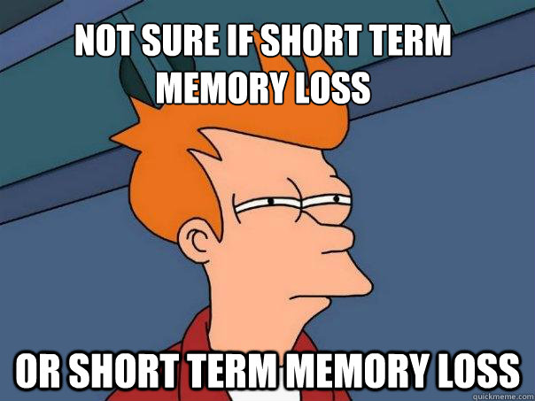

```{r, include=FALSE}
library(knitr)
opts_chunk$set(tidy.opts=list(width.cutoff=60, out.width = '.6\\linewidth'),tidy=TRUE, warning=FALSE, message=FALSE)

```

```{r setup, include=FALSE}
library(xaringanExtra)
options(htmltools.dir.version = FALSE)
knitr::opts_chunk$set(echo = TRUE)
```

```{r xaringan-tile-view, echo=FALSE}
xaringanExtra::use_tile_view()
```

## PY0794: Advanced Quantitative research methods.
* Last lecture:  SEM II: Mediation.
* Today: Multilevel: part I.

---
## Goals (today / next week)
 
Multilevel models

**Not**: Make you a 'multilevel' expert. That would take an entire separate course! But you should be able to apply the basics and understand when you come across it.

```{r, out.width = "400px", echo=FALSE, fig.align='center'}
knitr::include_graphics("https://media.giphy.com/media/znUBeE6w9U7HG/giphy.gif")
```

---
## Assignment
After today you should be able to complete the following sections for Assignment II:

 Multilevel model. (Some bits still next week. Such as plotting it.)
 
---
## Other packages.

MLwin, SPSS (to a degree - cannot do some more complex models (easily)), SAS, Stata, HLM.

R -- many options.
 
---
## Why multilevel?

'Group' data are everywhere... .

Independence although commonly assumed, often is not present. [(Kruskal, 1988)](https://www.jstor.org/stable/2290117?seq=1#page_scan_tab_contents)

```{r, out.width = "400px", echo=FALSE, fig.align='center'}
knitr::include_graphics("https://imgflip.com/s/meme/X-Everywhere.jpg")
```

---
## Some examples of applications... .

Children in classes in schools.

Employees in depts. in companies (in regions)

Individuals nested in neighbourhoods. Neighborhoods in districts/provinces. Countries nested in regions.

Individuals in couples/families.

Patients assigned to the same therapist - therapists nested in hospitals.

Stimuli in sets. Block designs.

---
## Naming frenzy... . 

Multilevel model

Random effects model

Mixed model

Random coefficient model

Hierarchical model

```{r, out.width = "300px", echo=FALSE, fig.align='center'}
knitr::include_graphics("https://media.giphy.com/media/l2Je4zlfxF6z0IWZi/giphy.gif")
```

---
## Simpson's paradox / Ecological Fallacy (atomistic fallacy).

Very simply put: depending on the level of analysis you can get very different results.

Different levels of analysis.

Famous example. [Robinson (1950)](http://www.jstor.org/stable/2087176?seq=1#page_scan_tab_contents) on literacy and migrants.

Graphically:

```{r, out.width = "250px", echo=FALSE, fig.align='center'}
knitr::include_graphics("https://tvpollet.github.io/img/EcolFallGert.png")
```

---
## (Good) Reasons to opt for multilevel model.

Good reasons from [here](http://www.bristol.ac.uk/cmm/learning/multilevel-models/what-why.html):

"**Correct inferences**: Traditional multiple regression techniques treat the units of analysis as **independent** observations. If there is a hierarchical structure: standard errors of regression coefficients will (likely) be underestimated, leading to an overstatement of statistical significance. 

**Substantive interest in group effects**: In many situations a key research question concerns the extent of grouping in individual outcomes, and the identification of ‘outlying’ groups. For example, in evaluations of school performance we might be interested in the ‘value-added’ school effects on pupil attainment. To achieve this: school-level residuals in a multilevel model adjusting for prior attainment."

---
## Reasons to opt for multilevel models.

"**Estimating group effects simultaneously with the effects of group-level predictors**: An alternative way to allow for group effects: include dummy variables for groups in a traditional (ordinary least squares) regression model. Such a model is called an analysis of variance or fixed effects model. In many cases there will be predictors defined at the group level, e.g. type of school (mixed vs. single sex). In a fixed effects model, the effects of group-level predictors are confounded with the effects of the group dummies: it is not possible to separate out effects due to observed and unobserved group characteristics. In a multilevel (random effects) model, the effects of both types of variable can be estimated."

--

"**Inference to a population of groups**: In a multilevel model the groups in the sample are treated as a random sample from a population of groups. Using a fixed effects model, inferences cannot be made beyond the groups in the sample."

--

If you get bored: I actually wrote on this: [monkeys](https://drive.google.com/file/d/1Zl20op28MwbVKS0WCBCbwMbFeO-Bavsw/view?usp=sharing) / [countries](https://drive.google.com/file/d/1Zl20op28MwbVKS0WCBCbwMbFeO-Bavsw/view?usp=sharing).

---
## What multilevel models can and cannot do.

Read [this](http://www.stat.columbia.edu/~gelman/research/published/multi2.pdf). 

They allow for more accurate estimation of effects (for example, you could predict what would happen for a new school or class or individual). However, easy to mistake for **causal** effects -- i.e. the school is causing the effect of X,Y,Z.

---
## Assumptions.

You'll need to be aware of these. We will not (always) check them here... . It's regression again... .

Do you remember the assumptions? Potential ways of checking them?

```{r, out.width = "300px", echo=FALSE, fig.align='center'}

```

More [here](http://ademos.people.uic.edu/Chapter18.html)

---
## Sample sizes. 

You can read about it [here](https://dspace.library.uu.nl/bitstream/handle/1874/23635/hox_05_sufficient%20sample%20sizes.pdf) and [here](https://pdfs.semanticscholar.org/a769/1eb67c5806e154da58a74f7b1a1bc9ccb58a.pdf).

It depends which level you are interested in and whether you care about fixed vs. random effect. You can consider Bayesian models which have better properties for smaller samples (but come with their own challenges).

---
## lme4, nlme, MCMCglmm, brms.

R packages.

Lme4 -- linear models 

nlme -- non-linear models. but can also do linear models.

MCMCglmm -- Bayesian models.

brms -- Bayesian Regression Models via Stan.

---
## LME4 and nlme.

Main packages - it's up to you to pick... . Note that the codes differ between those packages!


```{r, out.width = "400px", echo=FALSE, fig.align='center'}
knitr::include_graphics("https://media.giphy.com/media/l36kU80xPf0ojG0Erg/giphy.gif")
```


---
## Example

The dependent variable is the standardized result of a student on a specific exam (“normexam”). 

In estimating the score on the exam, two levels: student and school. 

On each level, one explanatory variable is present. On individual level, we are taking into account the standardized score of the student on a LR-test (London Reading test, “standLRT”). On the school-level, we take into account the average intake-score (“schavg”).

More info: Goldstein, H., Rasbash, J., et al. (1993). A multilevel analysis of school examination results. _Oxford Review of Education, 19_,  425-433. And [here](http://www.rensenieuwenhuis.nl/r-sessions-16-multilevel-model-specification-lme4/)

---
## Multilevel model. (lme4)

```{r, warning=F, message=F}
setwd("~/Dropbox/Teaching_MRes_Northumbria/Lecture10")
library(mlmRev) # contains data
library(lme4)
Exam<-mlmRev::Exam 
null_model<-lmer(normexam ~ 1 + (1 | school), data=Exam, REML=F)
```

---
## Summary 

```{r}
sink("null_model.txt")
summary(null_model)
sink()
```

---
## REML vs. ML

We came across Maximum Likelihood (ML) before. Restricted Maximum Likelihood (REML) might be new. REML has better properties for estimating effects in small samples but does not allow for model comparison for fixed effects.

When comparing fixed effects we would use ML. We can quantify the evidence for each model. Remember that we can also rescale and assign [AIC weights](http://ejwagenmakers.com/2004/aic.pdf).

We can also average across models (have a look at the [MuMin package](https://www.r-bloggers.com/model-selection-and-multi-model-inference/), for example.)

---
## nlme.

Same model as before but now in nlme.

```{r, warning=F, message=F}
require(nlme)
lme(fixed = normexam ~ 1, data = Exam,random = ~ 1 | school)
```

---
## Fixed predictor at individual level

Note that the effect of 'standLRT' is not varying between groups. We are only looking at the individual level. We allow schools to vary based on 'normexam' but not as a function of 'standLRT'. So no random slopes just random intercepts.

---
## Model random intercept + fixed effect.

```{r}
fixed_pred<-lmer(normexam ~ standLRT + (1 | school), data=Exam, REML=F)
summary(fixed_pred)
```

---
## Where are my p values?

You can see _t_ values but not _p_ values.

Read more about [this](http://bbolker.github.io/mixedmodels-misc/glmmFAQ.html#what-are-the-p-values-listed-by-summaryglmerfit-etc.-are-they-reliable).

Inference best done in other ways... . 

```{r, out.width = "500px", echo=FALSE, fig.align='center'}
knitr::include_graphics("https://media.giphy.com/media/3o7aTskHEUdgCQAXde/giphy.gif")
```


---
## Model comparison.

When comparing FIXED effects we rely on ML. (The $\chi^2$ is known as the likelihood ratio test).

```{r}
anova(null_model, fixed_pred)
```

---
## Sample write up.

A likelihood ratio test suggested that a model with a fixed effect for the London Reading test was a better fit, as compared to a null model ( $\chi^2$= 1653.4, $p$ <.0001).

---
## Model comparison random effects.

With caution (!), we can use REML to compare RANDOM effect structures. Does it matter when you allow the effect of standLRT to vary between schools?

In the second model, a model with a random intercept on individual level and a predictor that is allowed to vary between groups. In other words, what happens if we allow the effect of the London Reading Test to vary between schools: in some schools the effect of that test could be larger and in others it could be smaller.

---
## Model comparison II

```{r, warning=F}
# suppressed a convergence warning
randomslope<- lmer(normexam ~ 1 + (standLRT | school), data=Exam)
null_reml <- lmer(normexam ~ 1 + (1 | school), data=Exam)
anova(null_reml,randomslope, refit=F) # Otherwise it uses ML.
```

---
## Random Slope, summary

```{r}
summary(randomslope)
```

---
## Another recommendation (conditional AIC).

[conditional AIC](https://www.jstor.org/stable/20441193?seq=1#page_scan_tab_contents). This similarly suggests that a random slope model is a better fit. (Have a look at cAIC4, it can also do bootstraps if you would need it.)

```{r, message=F, warning=F}
require(cAIC4)
cAIC(null_reml)$caic
cAIC(randomslope)$caic
```

---
## plot random intercept

```{r, fig.align="center",fig.height=4, fig.width=8}
plot(ranef(fixed_pred))
```
---
## plot random slope

```{r, fig.align="center",fig.height=4, fig.width=8}
plot(ranef(randomslope))
```

---
## Model with random slope AND fixed effect. 

This model has both a random slope at school level for 'standLRT' and a fixed effect at the individual level. This model allows the effect to vary as a function of school but still allows us to examine it at the individual level as well.  

---
## Model with random slope AND fixed effect.

```{r}
standLRT<-lmer(normexam ~ standLRT + (standLRT | school), data=Exam, REML=F)
sink(file = 'standLRT.txt')
summary(standLRT)
sink()
```

---
## Group variables.

It is possible to enter variables on group level as well. Here, we will add a predictor that indicates the size of the school. The lmer-function needs this variable to be of the same length as variables on individual length. In other words: for every unit on the lowest level, the variable indicating the group level value (here: the average score on the intake-test for every school) 

---
## Model.

```{r tidy.opts=list(width.cutoff=10, size = "footnotesize")}
schoolaverage<-lmer(normexam ~ standLRT + schavg + (1 + standLRT | school), data=Exam, REML=F)
sink(file = 'schoolaverage.txt')
summary(schoolaverage)
sink()
```

----
## Export some of the results.

```{r message=F, warning=F, tidy.opts=list(width.cutoff=2, size = "footnotesize")}
require(stargazer)
stargazer(null_model,standLRT,schoolaverage, type="html", dep.var.labels = c("Scores"), covariate.labels=c("London reading test", "School average"), style= "demography", out= "multilevel models.html", header=F)
```

---
## Try it yourself.

Load 'ScotsSec' form the mlmRev package.

Scores attained by 3435 Scottish secondary school students on a standardized test taken at age 16. Both the primary school and the secondary school that the student attended have been recorded. 

Paterson, L. (1991). Socio economic status and educational attainment: a multidimensional and multilevel study. _Evaluation and Research in Education, 5,_ 97-121.

```{r, out.width = "200px", echo=FALSE, fig.align='center'}
knitr::include_graphics("https://media.giphy.com/media/H9DIRWjUeRjrO/giphy.gif")
```

---
## Try it yourself.

Test a null model (random intercept at 'second') and 'attain' as dependent.

Build a model with a fixed effect of 'verbal' and a random intercept (second) and 'attain' as dependent. Compare it to the null model. Export the results.

Build a model with a school level (second) a random intercept + slope (verbal) and 'attain' as dependent. Compare it to the null model.

Make a plot.

---
## Significance check for random effect?

```{r, message=F, warning=F}
require(lmerTest)
ranova(fixed_pred) # rand() is alternative command but leads to issues.
```

---
## Some diagnostic checks.

Check [this](https://cran.r-project.org/web/packages/DHARMa/vignettes/DHARMa.html). You can also [sj.Plot](http://www.strengejacke.de/sjPlot/sjp.lmer/).

Are the residuals normal and linear? We are looking for straight lines... .

```{r, message=F,warning=F, fig.align="center",fig.height=4, fig.width=8}
require(DHARMa)
# 250 is the default.
simulationOutput <- simulateResiduals(fittedModel = fixed_pred, n = 250)
plotSimulatedResiduals(simulationOutput = simulationOutput)
```

---
## Formal test.

We can also obtain a formal test.

```{r, fig.height=4, fig.width=8}
testUniformity(simulationOutput = simulationOutput)
```

---
## plot homogeneity check.

Check our residuals. No real funnel. Homogeneity OK.

```{r, fig.height=4, fig.width=8}
plot(fixed_pred)
```

---
## Some tips.

Centering: sometimes you are interested in cross-level interactions. In such a case, it is sensible to grand mean center your variables first.

Statistical power. Depending on the effect you are looking for the sample sizes you'll need will vary. But tends to be quite 'data hungry'. You can simulate your power based on [here](http://onlinelibrary.wiley.com/doi/10.1111/2041-210X.12504/abstract) or [this website](https://jakewestfall.shinyapps.io/two_factor_power/)

Effect size measures. These are generally not easy to obtain but have a look at the intra-class correlation coefficient [here](https://cran.r-project.org/web/packages/iccbeta/iccbeta.pdf) or [here](http://onlinelibrary.wiley.com/doi/10.1111/2041-210X.12225/full)

---
## More levels!

Not evaluated here. But often (as in your assignment) you will have nested data.

```{r, eval=F}
# This would nest classes in schools.
# lme 4
(1|school/class)
# nlme: Classes in schools.
random = ~1 |school/class
# Suppose that you have two memberships which are non-nested
# lme4
(1 | school) + (1 | doctor)
# Harder to do in nlme - find out on your own it involves lists :)
```

```{r, out.width = "300px", echo=FALSE, fig.align='center'}
knitr::include_graphics("https://media.giphy.com/media/MJ6SslGZEYKhG/giphy.gif")
```

---
## Just to give you an idea.

```{r, fig.align="center",fig.height=4, fig.width=8}
require(lmerTest)
plot(ranef(null_model))
```

---
## Random slope... .

```{r, fig.align="center",fig.height=4, fig.width=8}
plot(ranef(randomslope))
```

---
## Bootstrap a fixed effect.

```{r, warning=F, message=F, tidy.opts=list(width.cutoff=5, size = "footnotesize")}
require(lmeresampler)
require(boot)
require(lme4)
require(mlmRev)
Exam<-mlmRev::Exam 
set.seed(1981)
b<-bootstrap(model = schoolaverage, .f = fixef, type = "case", resample = c(TRUE, TRUE), B=100)
# Only small number to save time normally >1000
boot_data<-as.data.frame(b$replicates)
```

---
## Results.

```{r, warning=F, message=F, tidy.opts=list(width.cutoff=5, size = "footnotesize")}
require(skimr)
print(skim(boot_data))
```


---
## Results (cont'd).

```{r}
quantile(na.omit(boot_data$schavg), prob = c(0.025, 0.975))
```

---
## Sample write up.

A case resampling bootstrap procedure with 100 resamples showed that the effect of school average was robust (95%CI [.104, .572]).

Note that sometimes the bootstraps will not converge (it is possible that you would draw the same case over and over, especially in small clusters)

---
## Next week.

Next week we will look closer at some common experimental designs and how they may be cast into multilevel models.

Depending on time we will also cover what happens when you have common issues.

We will also make some (nicer) graphs.

---
## Exercise

Download the data from [here](http://www.bodowinter.com/tutorial/politeness_data.csv)

Build a model: model 1: pitch ~ politeness + sex + (1|subject) + ε . $\epsilon$ does not have to be modelled explicitly, those are the residuals. politeness is called attitude in the dataset and pitch is called frequency. Sex is labelled gender.

Test this against a null model: pitch ~ (1|subject) + ε . Which one is the better fit?

Bootstrap the politeness effect from model 1.

Compare model 1 to this model pitch ~ politeness + sex + (1|subject) + (1|item) + ε . Note that items are called scenarios.

---
## Exercise (cont'd)

Make a model with random slopes for politeness for both subjects and items, have it include a fixed effect as well.

Compare this model with random slopes to a model with just random intercepts (but with the fixed effect).

Bootstrap the fixed effect.

---
## References (and further reading.)
Also check the reading list! (many more than listed here).

* Gelman, A., & Hill, J. (2006). _Data analysis using regression and multilevel/hierarchical models._ New York, NY: Cambridge University Press.

* Hox, J. J. (2010). _Multilevel analysis: Techniques and applications (2nd ed.)._ London: Taylor & Francis.

* Magnusson, K. (2015). Using R and lme/lmer to fit different two- and three-level longitudinal models [http://rpsychologist.com/r-guide-longitudinal-lme-lmer](http://rpsychologist.com/r-guide-longitudinal-lme-lmer)

* Nieuwenhuis, R. (2017). R-Sessions 16: Multilevel Model Specification (lme4) [http://www.rensenieuwenhuis.nl/r-sessions-16-multilevel-model-specification-lme4/](http://www.rensenieuwenhuis.nl/r-sessions-16-multilevel-model-specification-lme4/)

* Snijders, T. A. B., & Berkhof, J. (2008). Diagnostic Checks for Multilevel Models. In: _Handbook of Multilevel Analysis_ (pp. 141–175). New York, NY: Springer New York. http://doi.org/10.1007/978-0-387-73186-5_3

* Snijders, T. A. B., & Bosker, R. J. (1999). _Multilevel analysis: An introduction to basic and advanced multilevel modeling_. London: Sage Publications Limited.