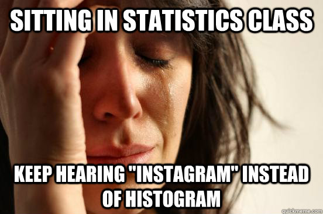

```{r, include=FALSE}
library(knitr)
opts_chunk$set(tidy.opts=list(width.cutoff=60, out.width = '.6\\linewidth'),tidy=TRUE, warning=FALSE, message=FALSE)

```

```{r setup, include=FALSE}
library(xaringanExtra)
options(htmltools.dir.version = FALSE)
knitr::opts_chunk$set(echo = TRUE)
```


```{r xaringan-tile-view, echo=FALSE}
xaringanExtra::use_tile_view()
```

## PY0794: Advanced Quantitative research methods.
Last week: All about visualization.

Today: ANOVA 

---

## Goals (today)

* ANOVA and its variants

--

* Non-parametric alternatives.

---
## Assignment
After today you should be able to complete the following sections:

* ANOVA / ANCOVA / MANOVA

--

* Non-parametric alternatives to  these.

---
## ANOVA

Raise your hand if you have never conducted an ANOVA.

Analysis of Variance.

```{r, out.width= "600px", echo=FALSE}
knitr::include_graphics("https://media.giphy.com/media/3o6Ztr0m2onpgjywj6/giphy.gif")
```

---
## Back to basics: Variance.

 A note on notation: $$\sigma^2, s^2, var(X)$$

--

 A measure of **variability**

--

 Can you name other measures?

--

 We can calculate it for a  _sample_ but usually we want to infer this for a _population_.

--

 Remember $$SD=\sqrt{variance}$$

---
## Why would you need an ANOVA? 
 
 We want to compare differences between two or **more** means.

--

 Why not simply run a bunch of _t_-tests?
 
--

 Type I error! (a lot of type I errors)

---
## How does it work?
 
 Imagine a study with three groups --> three means: $\bar x_1, \bar x_2, \bar x_3$

--

 We want to find out if those significantly differ.

--

 Grand mean: $\bar x_g$

---
## Formulae (for your reference)
 
 Within- and Between- Sum of Squares (SS)

--

 Mean square within (with 3 samples): $$M_{WithinSS}=\dfrac{\sigma_1^2+\sigma_2^2 + \sigma_3^2}3$$

--

 Mean square between: $$M_{BetweenSS}= \dfrac{\sum_{i=1}^n (\bar x_i - \bar x_g)^2}{N-1}$$ with N-1.

--

 Basic gist: if between > within evidence for an effect!


---
## F-test

 $$F= \dfrac{M_{BetweenSS}}{M_{WithinSS}}$$

 look up corresponding degrees of freedom. 

 Compare significance.

---
## Assumptions.

Dependent variable is interval.

--

Independent observation (more about this when we discuss multilevel models).

--

Normally distributed for each category of the Independent variable.

--

[Homogeneity of variance](http://davidmlane.com/hyperstat/A45619.html)

```{r, out.width = "350px", fig.align="center", echo=FALSE}
knitr::include_graphics("https://pbs.twimg.com/media/DJtZt-TWAAAWnDm.jpg")
```

---
## Time for a new dataset?

 Go to [https://psychology.okstate.edu/faculty/jgrice/personalitylab/methods.htm#MANOVA](https://psychology.okstate.edu/faculty/jgrice/personalitylab/methods.htm#MANOVA)

--

 Download the SPSS dataset to your working folder

--

 Open the SPSS dataset.  

---
## Load data. 

Three groups (Asians (international), Asian Americans, European Americans), NEO PI-R. Read more [here](https://psychology.okstate.edu/faculty/jgrice/personalitylab/Grice_Iwasaki_AMR.pdf)

```{r}
setwd("~/Dropbox/Teaching_MRes_Northumbria/Lecture3")
require(haven)
data<-read_spss("Iwasaki_Personality_Data.sav", user_na=T)
```

---
## Skim

```{r}
require(skimr)
skim(data)
```

---
## Reduced set.

2 missings. Remove this, find out the codings.

```{r}
require(dplyr)
require(labelled) # use this to turn into a factor
data$GRP<-to_factor(data$GRP) #GRP is dbl+lbl
# missings are Not a number.
data_no_miss<-dplyr::filter(data, GRP!='NaN')
levels(data_no_miss$GRP)
```

---
## Openness to Experience.

Test whether groups differ in Openness to Experience (O) based on their culture.

```{r, out.width= "450px", fig.align="center", echo=FALSE}
knitr::include_graphics("http://i0.kym-cdn.com/photos/images/original/001/090/918/8f8.jpg")
```

---
## Assumption Checks.

Non-independent observations = check!

Interval dependent = check!

Normality --> Plot

Homogeneity of variance.

---
## Plot

Look back at week 2 to make this a more beautiful plot!

Mostly people would look at the _overall_ plot, but ideally one would check plots for each group.

```{r fig.align="center",fig.height=3, fig.width=6, opts_chunk$set(out.width = 50), tidy=T}
require(ggplot2)
plot_hist <- ggplot(data_no_miss, aes(x=O)) 
plot_hist <- plot_hist+ geom_histogram(colour = "black", fill = "white")
plot_hist 
```

---
## Plot facets.

```{r fig.align="center",fig.height=5, fig.width=6}
plot_hist_facet <- ggplot(data_no_miss, aes(x=O)) 
plot_hist_facet <- plot_hist_facet+geom_histogram(colour = "black", fill = "white") 
plot_hist_facet + facet_wrap(~GRP)
```

---
## Normality

What do you think?
 
---
## Fairly Robust.

Remember central limit theorem!

```{r, out.width = "500px", echo=FALSE}
knitr::include_graphics("https://upload.wikimedia.org/wikipedia/commons/thumb/2/2d/Empirical_CLT_-_Figure_-_040711.jpg/500px-Empirical_CLT_-_Figure_-_040711.jpg")
```

---
## Other approaches: Shapiro-Wilk

Not significant --> retain null hypothesis, not significantly different from normal distribution.

--

```{r}
data_eur<-filter(data_no_miss, GRP=='European Americans')
data_asian_i<-filter(data_no_miss, GRP=='Asian Internationals')
data_asian_a<-filter(data_no_miss, GRP=='Asian Americans')
# You would do this for all 3!
shapiro.test(data_asian_a$O)
```

---
## Kolmogorov-Smirnov.

Beware K-S test: easily significant! 

--

```{r}
ks.test(data_asian_a$O, "pnorm") #pnorm --> normal distribution
```

---
## Visual checks.

Recommendation check normality visually! (histogram / violin plot / ...)

Think back to the 'Datasaurus'.

```{r, fig.align="center", out.width = "400px", echo=FALSE}

```

---
## Variety of other options.

??nortest package. Read the vignette and references.

 Anderson-Darling test.

 Cramer-von Mises test.

 Lilliefors test (K-S) (correction of K-S).

 Shapiro-Francia test.

 Jarque Bera test (+ adjusted).

---
## Homogeneity of variance.

Bartlett's test - assumes normality.

--

If significant could also point to deviation in normality as opposed to violation of the assumption of homogeneity of variance.

--

```{r, warning=FALSE}
bartlett.test(O ~ GRP, data=data_no_miss)
```

---
## Levene's test.

[Levene's test](http://www.itl.nist.gov/div898/handbook/eda/section3/eda35a.htm) does not assume normality.

```{r, warning=F, message=F}
require(car) # package which does test
require(dplyr)
# It needs to be a factor but already is!
leveneTest(O ~ GRP, data=data_no_miss)
```

---
## Outcome of assumption checks.

Assumptions are upheld here! 

Sample write up:
Visual inspection suggested that the distribution of the dependent variable is close to normal. A Levene's test suggests that the assumption of homogeneity of variances is not violated, _F_(2,200) = 1.71, _p_= .18) 

We can move on to ANOVA!

```{r, fig.align="center", out.width = "400px", echo=FALSE}
knitr::include_graphics("http://www.reactiongifs.com/r/hfma.gif")
```

---
## Kurtosis/Skewness. 

As an aside: you could mention, the platykurtosis in the Asian American group.

(In your assignment I would count both correct in this case).

```{r, fig.align="center", out.width = "400px", echo=FALSE}
knitr::include_graphics("https://www.researchgate.net/profile/John_Mitchell2/publication/5570487/figure/fig1/AS:213411729285120@1427892729413/Mesokurtic-leptokurtic-and-platykurtic.png")
```

```{r, fig.align="center", out.width = "400px", echo=FALSE}
knitr::include_graphics("https://miro.medium.com/max/1020/1*hxVvqttoCSkUT2_R1zA0Tg.gif")
```

---
## Try it yourself.

Test the assumptions for an ANOVA with Extraversion (E) and group as independent variable.

```{r, fig.align="center", out.width = "500px", echo=FALSE}
knitr::include_graphics("https://media.giphy.com/media/3o6MbgJH2fc63n6v4I/giphy.gif")
```

---
## ANOVA.

[Many ways to do an ANOVA.](https://web.archive.org/web/20171212214358/http://talklab.psy.gla.ac.uk/r_training/anova/index.html)

Why this matters will become clearer when we discuss Types of Sums of Squares.

---
## aov()

Analysis of variance.

```{r}
Anova1<-aov(O ~ GRP, data=data_no_miss)
summary(Anova1)
```

---
## lm(): Linear model.

```{r}
Anova2<-lm(O~ GRP, data=data_no_miss)
summary(Anova2)
```

---
## F-test.

summary prints parameter tests but should you be after the _F_-test.

--

```{r}
anova(Anova2)
```

---
## Drop1.

For your reference. drop1 can also get you some relevant key info.

Don't worry about [AIC](https://en.wikipedia.org/wiki/Akaike_information_criterion) for now. It is a model fit statistic (lower = better). More about this when we discuss multilevel models.

```{r}
drop1(Anova2) # some additional info. ??drop1
```

---
## ez Package

Best bet for replicating SPSS results!

```{r}
require(ez)
Ez_ANOVA1<-ezANOVA(data_no_miss, dv=O, wid=ID, between=GRP, detailed=TRUE)
```

```{r opts_chunk$set(out.width = '.6\\linewidth')}
Ez_ANOVA1
```

---
## ges?

Effect size measure!

--

ges= Generalized Eta-Squared. $\eta^2_g$ . There is also _partial_ $\eta^2$. Read more [here](https://lbecker.uccs.edu/glm_effectsize).

--

How to do Greek symbols and mathematical functions? [here](http://csrgxtu.github.io/2015/03/20/Writing-Mathematic-Fomulars-in-Markdown/) or check the .rmd for this lecture.

---
## Omega squared and partial omega squared.

If you are up for a challenge. You can figure out how to calculate this effect size measure on your own!.

```{r fig.align="center", out.width = "380px", echo=FALSE}
knitr::include_graphics("https://pbs.twimg.com/media/B11-iLMCQAEotPP.jpg")
```

---
## Write up.

A one-way ANOVA showed a significant effect of cultural group on openness to experience *F*(2, 200) = 15.05, *p* < .0001, $\eta^2_g$ = .13. 

---
## Store results

```{r}
require(apaTables)
apa.aov.table(Anova1, filename="APA_Anova_Table.doc", table.number = 1)
```

---
## Post-hoc tests.

 Where does the difference lie?

```{r, fig.align="center", out.width = "350px", echo=FALSE}
knitr::include_graphics("http://1.bp.blogspot.com/-tgrTTYSW8V8/UzVuNLzHzcI/AAAAAAAADfw/Pxpfw42Ie_0/s1600/ANOVA.jpg")
```

---
## Post-hoc tests.

```{r}
resultTukey<-TukeyHSD(Anova1)
resultTukey
```
---
## Post-hoc tests: corrections.

Have you heard of post-hoc corrections? Why do they exist?

--

Read more [here](https://stats.idre.ucla.edu/r/faq/how-can-i-do-post-hoc-pairwise-comparisons-in-r/) and use them sensibly.

--

Why Bonferroni should be abandoned (in [medicine](https://www.ncbi.nlm.nih.gov/pmc/articles/PMC1112991/) and [ecology](https://academic.oup.com/beheco/article/15/6/1044/206216/A-farewell-to-Bonferroni-the-problems-of-low)).    

--

```{r, fig.align="center", out.width = "300px", echo=FALSE}
knitr::include_graphics("https://i.pinimg.com/736x/0a/b2/7f/0ab27f6bf618f07030b19fdf9823241f--statistics-psychology-jokes.jpg")
```

---
## Make a report. Stargazer.

You can make a prettier layout. By changing the variable names, etc. You can also change the labels it prints.

Totally check out stargazer!

```{r, results="hide", message= FALSE, warning= FALSE}
require(broom)
require(stargazer)
# Broom turns our result into a dataframe!
# We can then 'tidy' it and make a report!
tidy_resultTukey<-tidy(resultTukey)
stargazer(tidy_resultTukey, summary = F, type="html", out="Tukey.html")
```

---
## apaTables

Alternative. This will also have Cohen's d effect size values.

```{r, tidy.opts=list(width.cutoff=50), tidy=T}
require(apaTables)
apa.d.table(iv=GRP, dv=O, data=data_no_miss, filename="Table_1_APA_tukey.doc", show.conf.interval=T, landscape=T, table.number = 1)
```

---
## Try it yourself.


* Run an ANOVA with 'E' extraversion as the dependent, and group as the independent.

* Conduct the post-hoc tests and export those as either .html or .docx

---
## What if we were unlucky?

How would you have proceeded, if the assumptions were violated?

```{r, fig.align="center", out.width = "600px", echo=FALSE}
knitr::include_graphics("https://media.giphy.com/media/qBVEww0YjwWyI/giphy.gif")
```

---
## Non-parametric tests.

They do not assume a normal distribution but can be less powerful.

Many options exist. You can read and find others (see references).

```{r, fig.align="center", out.width = "300px", echo=FALSE}
knitr::include_graphics("https://media.giphy.com/media/12mlYz930XO2HK/giphy.gif")
```

---
## WRS2 package

The t1way function computes a one-way ANOVA for the trimmed means. Homoscedasticity assumption not required.

--

lincoln() for the posthoc tests.

--

```{r, warning=F, message=F}
#WRS.
require(WRS2)
t1way(O ~ GRP, data=data_no_miss)
```

---
## t1waybt (WRS2)

The t1waybt function computes a one-way ANOVA for the [_trimmed means_](http://davidmlane.com/hyperstat/A11971.html). 

--

```{r, warning=F, message=F}
# Specify Between.
t1waybt(O ~ GRP, data=data_no_miss, nboot=10000)
```

---
## med1way (WRS2)

Computes a one-way ANOVA for the medians. Homoscedasticity assumption not required. Avoid too many ties.

--

```{r, warning=F, message=F}
# WRS, ANOVA for Medians. (note iter=)
med1way(O ~ GRP, data=data_no_miss, iter=10000)
# analysis of Medians leads to same conclusion.
```

--

Read through WRS2 manual or Wilcox (2012) to find out more.

---
## Permutation tests.

Permutation tests use random shuffles of the data to get the correct distribution of a test statistic under a null hypothesis. (No power issue by the way)

--

Shuffles are not the same as bootstraps. Some assumptions do still apply (e.g., non-independence of observations).

--

Read more [here](http://thomasleeper.com/Rcourse/Tutorials/permutationtests.html) and [here](http://rcompanion.org/handbook/K_01.html)

--

```{r, warning=F, message=F}
require(coin)
independence_test(O ~ GRP, data=data_no_miss)
```

---
## Sample write up.

A permutation test via the 'coin' package showed that there are significant differences between the three groups in Openness to Experience (maxT= 5.10, _p_< .0001).

(Note post-hoc tests are currently unavailable via 'coin' but you can get them via 'rcompanion', more [here](https://rcompanion.org/rcompanion/d_06a.html))

---
## ANCOVA

The difference is the ***C***. Covariate.

--

Often we want to control for a potential confound, so suppose that you are testing a new weight loss drug. You could analyse the participant's weight at the end of the trial while partialling out their start weight. This would be an ANCOVA scenario (but [beware](http://files.eric.ed.gov/fulltext/ED312298.pdf)).

--

Beware of [Lord's paradox](http://m-clark.github.io/docs/lord/#lord’s_paradox). If one researcher calculates a change score and runs an independent samples _t_-test while the other runs an ANCOVA, don't expect the same conclusion. 

---
## Important: order effects.

The order in which you put in things matters!!

--

```{r}
# Type I errors
lm_ancova<-lm(O~E+GRP, data=data_no_miss)
anova(lm_ancova)
```

---
## Compare to previous slide!

```{r}
# note that the order matters for the F-tests.
lm_ancova2<-lm(O~GRP+E, data=data_no_miss)
anova(lm_ancova2)
```

---
## More about Types of errors later.

Type I,II,III errors. 

--

For now, you should be aware that type of errors matters (I,II,III). read more [here](http://www.utstat.toronto.edu/reid/sta442f/2009/typeSS.pdf) and [here](https://bookdown.org/ndphillips/YaRrr/anova.html#type-i-type-ii-and-type-iii-anovas)

--

SPSS uses type III. So let's aim to emulate (even though that might not always be [optimal](http://www.dwoll.de/r/ssTypes.php))

---
## Order invariant: SPSS uses Type III.

```{r}
# Type III errors
require(car)
require(compute.es)
Ancova<-lm(O~GRP+E, contrasts=list(GRP_fact=contr.sum), data=data_no_miss)
Anova(Ancova, type="III")
```

---
## post-hoc tests.

```{r}
require(multcomp)
posth=glht(Ancova, linfct=mcp(GRP="Tukey"))  
```

---
## summary(posth)

```{r}
summary(posth) ##shows the output in a nice format
```

---
## Sample write up. 

A one-way ANCOVA was conducted to compare Openness across groups whilst controlling for Extraversion. There was a significant effect of cultural group, _F_(2,199)=21.23, _p_<.0001. In addition, the effect of the covariate, Extraversion, was significant, _F_(1,199)=40.72, _p_<.0001.

--

You would then describe the post-hoc differences and also explore how extraversion is associated with (e.g., correlation, plot.)

---
## Non-parametric alternative.

Look at the 'lmPerm' package and [this](https://statmethods.wordpress.com/2012/05/21/permutation-tests-in-r/).

---
## MANOVA

All the previous assumptions + (+ multicollinearity (not an assumption but a problem)

--

Multivariate normality

--

Homogeneity of _co_-variances.

---
## Multivariate Normality

[Multivariate Shapiro test.](https://en.wikipedia.org/wiki/Shapiro%E2%80%93Wilk_test) (The Univariate's test bigger brother...).

--

Sensitive to sample size, if large small deviations will lead to significance.

```{r warning=F, message=FALSE}
require(RVAideMemoire)
multivariatenorm<-dplyr::select(data_no_miss, -GRP,-ID)
mshapiro.test(multivariatenorm)
```

---
## Alternative methods.

A whole host of alternatives. More [here](http://dwoll.de/rexrepos/posts/normality.html).

--

```{r, warning=F, message=F, tidy=T, tidy.opts=list(width.cutoff=50)}
require(MVN) # Alternative method, one example
mvn(multivariatenorm)
```

---
## Conclusion: Multivariate normality

Violated (but could be way worse, trust me ... )

```{r, out.width = "300px"}
mvn(multivariatenorm, multivariatePlot = "qq")
```

---
## Solutions.

Solution: Check for outliers, run analyses again. Report both!

--

Transformations. [Box-Cox transform](https://stat.ethz.ch/R-manual/R-devel/library/MASS/html/boxcox.html).

--

Central limit theorem to the rescue again! (also note Hotelling's $T^2$ robust)

```{r, fig.align="center", out.width = "300px", echo=FALSE}
knitr::include_graphics("https://media.giphy.com/media/D49L3FpxqtQ3u/giphy.gif")
```

---
## Homogeneity of variance.

As with the univariate case. So, you would run a series of tests such as Levene's Test and examine those.

Not done here but you can run these on your own.

---
## Homogeneity of covariances: Box's M test.

Approach with care. 

--

Very easily significant. Therefore, usually _p_=.001 as threshold. More [here](https://en.wikiversity.org/wiki/Box%27s_M).

--

```{r, warning=F, message=F}
require(heplots) #alternative is 'biotools' package.
boxM(multivariatenorm, data_no_miss$GRP)
```

---
## MANOVA

```{r}
Manovamodel <- manova(cbind(N,E,A,O,C) ~ GRP, data = data_no_miss)
summary(Manovamodel)
```

---
## MANOVA

Other measures exist but Pillai's Trace is typically most common. You can find out more about them [here](https://online.stat.psu.edu/stat505/lesson/8/8.3). Also about the **math** (also see references).

```{r, fig.align="center", out.width = "450px", echo=FALSE}
knitr::include_graphics("https://i1.wp.com/68.media.tumblr.com/29f192c8081899ed1f037ef6003384d3/tumblr_os2spqdfC71r0msi2o1_1280.gif?zoom=2&w=605&ssl=1")
```

---
## Report.

Pillai's Trace most commonly reported.

Sample report: A MANOVA was conducted with five dependent variables (Neuroticism, Extraversion, Conscientousness, Agreeableness, and Openness to Experience) and cultural group as the between-subject factor. A statistically significant effect was found (Pillai's Trace= .42, _F_(10,394)=10.43, _p_<.0001).

--

You would then report follow-up tests! (e.g., Univariate ANOVA's)

--

In conclusion the personality profiles differ between these 3 groups.

---
## Follow up tests

Univariate ANOVA's / plot your data / [Discriminant analysis](https://pjbartlein.github.io/GeogDataAnalysis/lec17.html).

---
## Exercise. 

Using last week's Salaries dataset, test the assumptions for an ANOVA with monthly salary as dependent variable and academic rank as independent variable.

Conduct an ANOVA with the appropriate post-hoc tests. What do you conclude?

Conduct an alternative non-parametric test to the ANOVA. What do you conclude.

Conduct an ANCOVA with gender as factor, and years since Ph.D. as covariate. What do you conclude? 

---
## Exercise continued.

Load the iris dataset, it is part of the [datasets package](https://rstudio-pubs-static.s3.amazonaws.com/204918_d5ccf842cbc540e78b3d6d3287e6ad38.html).

It is a famous dataset with measurements of 3 species of iris flowers.

Test the assumptions for a MANOVA with Species as the between-subject factor and petal length and sepal length as dependent variables.

Run the MANOVA. What do you conclude? Write up the result as you would do for a paper?

BONUS: Plot one of the results from your analyses on the salaries database.

BONUS: Conduct a follow up analysis or plot for the MANOVA.

---
## References (and further reading.) 

* Crawley, M. J. (2013). _The R book: Second edition._ New York, NY: John Wiley & Sons.
* Kassambara, A. (2017) STHDA: _[One way ANOVA in R](http://www.sthda.com/english/wiki/one-way-anova-test-in-r)_ 
* Kassambara, A. (2017) STHDA: _[Statistical tests and assumptions](http://www.sthda.com/english/wiki/statistical-tests-and-assumptions)_
* Mangiafico, S. (2017) [rcompanion](http://rcompanion.org/handbook/)
* Siegel, S. & Castellan, N.J. Jr. (1988). _Nonparametric statistics for the behavioral sciences. 2nd Edn._ McGraw-Hill, New York.
* Wickham, H., & Grolemund, G. (2017). _[R for data science](http://r4ds.had.co.nz/)_. Sebastopol, CA: O’Reilly.
* Wilcox, R. (2012). Introduction to Robust Estimation and Hypothesis Testing (3rd ed.). New York, NY: Elsevier.


