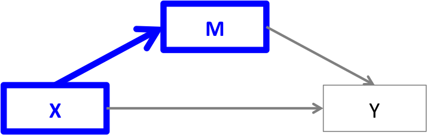
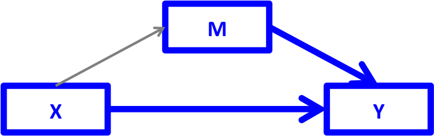

```{r setup, include=FALSE}
knitr::opts_chunk$set(echo = TRUE)
```


## PY0794: Advanced Quantitative research methods.
* Last lecture: Moderation effects. two-way ANOVA
* Today: Mediation

---
## Goals (today)
 
 Diagrams
 
 Mediation: Many ways of reaching the same goal... .

```{r, out.width = "300px", echo=FALSE, fig.align='center'}
knitr::include_graphics("https://media.giphy.com/media/YOAS9D27FLCQznt1tR/giphy.gif")
```

---
## Assignment

After today you should be able to complete the following sections for Assignment II:

 Mediation (Baron / Kenny).
 
 Sobel z  / Preacher & Hayes Method.
 
 Imai, Keele, & Tingley Method.

---
## What is a mediation?

Any of you ever conducted a mediation test?

What scenarios would a mediation test be useful?

```{r, out.width = "300px", echo=FALSE, fig.align='center'}
knitr::include_graphics("https://media.giphy.com/media/fVyPPH3Mm8eBb2gsht/giphy.gif")
```

---
## Mediation.

Grown out of path models. 

A --> C

A --> B --> C

We might be especially interested if the relationship between A and C is **fully** explained by B!

---
## Path models.

Date all the way back to 1921 and [Sewall Wright](http://www.ssc.wisc.edu/soc/class/soc952/Wright/Wright_Correlation%20and%20Causation.pdf).

These are chains of OLS regressions where we can divide the contribution of coefficients (direct, indirect, total). (Note that you should check the assumptions of OLS for each relevant step).

No 'loops' are allowed... .

(More advanced: DAGs -- Directed Acyclic Graphs)

---
## Causal?

What do you think?

--

Hidden confounders. 

--

Choice of arrows. 

--

Experimental manipulations.

---
## Drawing Diagrams.

Alternative to Powerpoint.

```{r, out.width = "500px", echo=FALSE, fig.align='center'}
knitr::include_graphics("https://media.giphy.com/media/Oo6GWyiWEDgtO/giphy.gif")
```

---
## Diagrammer.
```{r, warning=F, message=F, results='hide'}
require(DiagrammeR)
mermaid(" graph LR
	        A(Age)-->F(Fertility)
	        A-->O(Cystic ovarian <br> disease)
	        A-->R(Retained <br> placenta)
	        R-->O
	        R-->M(Metritis)
	        M-->O
	        O-->F
	        M-->F
	        ")
```

---
## Plot

```{r, echo=F, message=F, warning=F,fig.align="center",fig.height=7, fig.width=7}
require(DiagrammeR)
mermaid(" graph LR
	        A(Age)-->F(Fertility)
	        A-->O(Cystic ovarian <br> disease)
	        A-->R(Retained <br> placenta)
	        R-->O
	        R-->M(Metritis)
	        M-->O
	        O-->F
	        M-->F
	        ")
```

---
## More beautiful...

```{r, message=F, warning=F, results='hide'}
grViz("
	digraph causal {	  # Nodes
	  node [shape = plaintext]
	  A [label = 'Age']
	  R [label = 'Retained\n Placenta']
	  M [label = 'Metritis']
	  O [label = 'Cystic ovarian\n disease']
	  F [label = 'Fertility']
	  # Edges
	  edge [color = black, arrowhead = vee]
	  rankdir = LR
	  A->F
	  A->O
	  A->R
	  R->O
	  R->M
	  M->O
	  O->F
	  M->F
	  # Graph
	  graph [overlap = true, fontsize = 10]}")
```

---
## Look at the shiny-shiny.

```{r, message=F, warning=F, echo=F}
grViz("
	digraph causal {
	
	  # Nodes
	  node [shape = plaintext]
	  A [label = 'Age']
	  R [label = 'Retained\n Placenta']
	  M [label = 'Metritis']
	  O [label = 'Cystic ovarian\n disease']
	  F [label = 'Fertility']
	  
	  # Edges
	  edge [color = black,
	        arrowhead = vee]
	  rankdir = LR
	  A->F
	  A->O
	  A->R
	  R->O
	  R->M
	  M->O
	  O->F
	  M->F
	  
	  # Graph
	  graph [overlap = true, fontsize = 10]
	}")
```

---
## Check Diagrammer tutorial

It can make all sorts of flow-charts and diagrams.

Back to mediation ... .

---
## Beware!

Differing views: Some argue that mediation is only useful when you **experimentally** manipulate the mediator. 

Also beware of sequencing! If you propose something to be a mediator then ideally it should be measured **after** your IV. If you propose complex chains A-->B-->C-->D, then you need to consider the temporal order of A,B,C,D. 

```{r, out.width = "300px", echo=FALSE, fig.align='center'}
knitr::include_graphics("https://media.giphy.com/media/QHCXq5IsZ4bFS/giphy.gif")
```

---
## Dataset.

Example, simulated data from [here](http://data.library.virginia.edu/introduction-to-mediation-analysis/)

X= grades

Y= happiness

Proposed mediator (M): self-esteem.

```{r, tidy.opts=list(width.cutoff=10, size = "footnotesize"), tidy=T}
# Data can be loaded from here http://static.lib.virginia.edu/statlab/materials/data/mediationData.csv
D<- read.csv("mediationData.csv")
Data_med<-D
```

---
## Causal steps approach (Baron and Kenny (1986) method).

Three steps to demonstrate existence of mediation. X → Y, X → M, and X + M → Y

Read more [here](http://webcom.upmf-grenoble.fr/LIP/Perso/DMuller/GSERM/Articles/Journal%20of%20Personality%20and%20Social%20Psychology%201986%20Baron.pdf). (as an aside >71,000 citations in Google Scholar).

---
## Step 1. 

There should be a relationship between X and Y, and the regression coefficient should be significant.

```{r, out.width = "300px", echo=FALSE, fig.align='center'}

```

---
## Test of step 1

We find a significant association.

```{r}
model_1 <- lm(Y ~ X, Data_med)
summary(model_1)
```

---
## Controversy.

According to Baron & Kenny (1986) if this step is not significant then there can be no mediation, and one should stop here!

However, according to other scholars one could still move forward, if there is a solid theoretical rationale for the relationship between X and Y. Check [this](https://pdfs.semanticscholar.org/e930/616bee242ec451b76f9998d81778042ad449.pdf).

Basically, it is possible that suppression is happening and the mediator is suppressing the relationship between X and Y.

```{r, out.width = "300px", echo=FALSE, fig.align='center'}
knitr::include_graphics("https://media.giphy.com/media/2vkUwFvCnTEtupTsqu/giphy.gif")
```

---
## Step 2.

The independent variable should also relate to the mediator. If not, then there would be no mediation

```{r, out.width = "300px", echo=FALSE, fig.align='center'}

```

---
## Test of step 2.

We also find support for this step... .

```{r}
model_2 <- lm(M ~ X, Data_med)
summary(model_2)
```

---
## Step 3.

The effect of X should be reduced when we included the mediator.

The B for X should be substantially reduced in size or drop out of significance (but [beware](http://jonathanrenshon.com/Teaching/NPS/ResearchDesign/Gelman-Significance.pdf))

```{r, out.width = "300px", echo=FALSE, fig.align='center'}

```

---
## Test of step 3.

```{r}
model_3 <- lm(Y ~ X + M, Data_med)
summary(model_3)
```

---
## Conclusion: 3 steps.

The coefficient dropped from .39 to 0.04. (Model 1 to Model 3). It also dropped out of significance. But is this significant in itself? We will return to this when we discuss SEM.

---
## How would you report it?

Typically researchers would make a diagram as shown and then add the B or $\beta$ coefficients. to it.

For example: 

```{r, out.width = "500px", echo=FALSE, fig.align='center'}

```

---
## Try it yourself.

Download your dataset from  [here](https://stats.idre.ucla.edu/wp-content/uploads/2016/02/mediation_data.sav). You might need right click and save as.

Conduct a causal steps mediation analysis, with 'math' as independent variable, 'read' as mediator and 'science' as outcome variable.

```{r, out.width = "300px", echo=FALSE, fig.align='center'}
knitr::include_graphics("https://media.giphy.com/media/jo7xZ9T1fAgwg/giphy.gif")
```

---
## Testing significance of the mediation.

Many ways to assess if the mediation is significant. 

Older models use [Sobel test](http://citeseerx.ist.psu.edu/viewdoc/download?doi=10.1.1.452.5935&rep=rep1&type=pdf). The Sobel test is also known as the 'product' moment approach. (Multiplication of paths). You can read also more [here](https://umassmed.edu/uploadedFiles/QHS/MacKinnonetal%20PM2002.pdf). There are also alternatives (Goodman / Aroian test).

Recommendation is bootstrapping methods. One method is Preacher & Hayes (2004),... .

---
## Sobel test

```{r, message=F, warning=F, tidy.opts=list(width.cutoff=20), tidy=T}
require(bda)
#reload (note that Rmarkdown is forgetful, so you might want to reload the data)
Data_med<- read.csv("mediationData.csv")
mediation.test(Data_med$M,Data_med$X, Data_med$Y)
```

---
## Sample write up.

A Sobel _z_ test showed that the mediation effect reported in Fig. X was significant (Sobel _z_= 4.33, _p_<.0001). 

---
## Three measures.

Slight differences in calculation.

Some recommend [Aroian](http://imaging.mrc-cbu.cam.ac.uk/statswiki/FAQ/SobelTest). (I am largely indifferent, and have mostly used Sobel in my previous work).

Downside measures only work well in 'large' samples (opinions vary as to what large is, perhaps >100 - but when in doubt use different method). 

Bootstrapping to the rescue!

---
## Mediation 

Here we use 10,000 bootstraps. The std=T command ensures standardization.

```{r, warning=F, message=F,fig.align="center",fig.height=3, fig.width=8, tidy.opts=list(width.cutoff=50, size = "footnotesize"), tidy=T}
require(psych)
mediationmodel1<-mediate(Y~X+(M), std=TRUE, data=Data_med, n.iter=10000, plot=F)
```

---
## Output

Exported the results. sink() command.

```{r, results='hide'}
sink("mediation.txt")
mediationmodel1
sink()
```

```{r, echo=F}
sink("mediation.txt")
mediationmodel1
sink()
```

---
## Result

Click [here](https://tvpollet.github.io/PY_0782/mediation.txt)

Sample write up:

A mediation model with 10,000 bootstraps indicated that the indirect path was significant, $\beta$= .3, SE = .06, 95% CI [.19, .43].

You could add the package which produced this.

---
## Plot.

```{r, message=F, warning=F, results='hide'}
setEPS()
postscript("path.eps", horizontal = FALSE, onefile = FALSE, paper = "special")
par(mar=c(1,1,1,1))
mediate.diagram(mediationmodel1)
dev.off
```

```{r, out.width = "400px", echo=FALSE, fig.align='center'}
knitr::include_graphics("https://tvpollet.github.io/PY_0782/path.png")
```

---
## Try it yourself.

Conduct either a Sobel test _or_ a bootstrapping test for the mediation you just did.

---
## Other method: 'mediate' package.

Based on [this paper](https://pdfs.semanticscholar.org/2d61/1458f70a315dec999cd044def11b28920a0b.pdf).

Long story short, this is a newer and perhaps better method.

```{r, out.width = "400px", echo=FALSE, fig.align='center'}
knitr::include_graphics("https://media.giphy.com/media/dZFSFnniLOXZQvkkd5/giphy.gif")
```

---
## Mediate

```{r, message=F, warning=F,tidy.opts=list(width.cutoff=50, size = "footnotesize"), tidy=T}
require(mediation)
med.fit<-lm(M~X, data=Data_med)
out.fit<-lm(Y~X+M, data=Data_med)
# Robust SE is ignored for Bootstrap. Otherwise omit boot=TRUE.
set.seed(1984)
med.out <- mediate(med.fit, out.fit, treat = "X", mediator = "M", boot=TRUE, sims = 10000)
```

---
## Results

```{r}
summary(med.out)
```

---
## Summary

The mediation analysis showed a significant average causal mediation effect (ACME): 0.36, 95%CI [0.21, 0.53], but the average direct effect (ADE) was not significant .04, 95%CI [-0.20, 0.29].

---
## Plot

```{r plot, out.height=450, out.width= 450}
plot(med.out) 
```

---
## Sensitivity analysis

'The sequential ignorability assumption must be satisfied in order to identify the
average mediation effects. This key assumption implies that the treatment assignment
is essentially random after adjusting for observed pre-treatment covariates
and that the assignment of mediator values is also essentially random once both
observed treatment and the same set of observed pre-treatment covariates are
adjusted for.’ (Imai et al., 2011, pp. 863–864)

Simply put: no hidden or unmeasured confounder(s), accounting for what we find!

---
## Sensitivity parameter

Simply put, the sensitivity parameter corresponds to the correlation between errors in the step 2 and step 3 regression equations in Baron & Kenny's terms.

It is assumed to be 0.

This parameter is denoted by $\rho$. 

Under sequential ignorability, $\rho$ is equal to zero and thus the magnitude of this correlation coefficient represents the departure from the ignorability assumption (about the mediator).

---
## How to test it?

```{r, message=F, warning=F}
sensitivity_analysis<-medsens(med.out, rho.by = 0.05) 
summary(sensitivity_analysis)
```

---
## Interpretation

$R^2_M*R^2_Y$ the proportion of the _previously unexplained variance_ in the mediator and outcome variables is required to be explained by an unobservable pretreatment confounder in order to render a mediation of 0.

$\widetilde{R^2_M}\widetilde{R^2_Y}$: How much  of the proportion of the _original_ variance explained by an unobserved confounder is required to render a mediation effect of 0?

--> 0.1395 . Depending on where you stand that's substantial or not.

---
## Critique

Many models could fit, no evaluation in terms of absolute fit. Perhaps, a model with several main effects also fits the data well. We will return to this when we discuss SEM.

When fitting multiple mediators, those will be averaged! So, there could be a scenario where one is important but another one is not.

```{r, out.width = "400px", echo=FALSE, fig.align='center'}
knitr::include_graphics("https://media.giphy.com/media/l4q819XpZi0SyAfXW/giphy.gif")
```

---
## Exercise

Download the data 'PSE_MOL_Doors.sav', these are the data from an experiment by Kamila Irvine and Piers Cornelissen. This file contains data on 95 women performing various scales and body image-related tasks. doors_front is the score from a gap estimation task, w_dn is the actual gap a participant can pass through. The (estimated) Point of subjective equality or PSE (the BMI they believe themselves to be) when viewing an imageset varying in BMI. Participants used the method of adjustment to estimate their body size with the same stimulus set as for the yes-no task (MOL).  BMI is the participant's actual BMI.

Test the mediation model: doors_front --> PSE --> BMI via the causal steps method by Baron & Kenny. Report as you would do in a paper.

Make a diagram. (use 'mediate')

---
## Exercise (cont'd)

Calculate a Sobel _z_ test and report.

Test the mediation via Preacher & Hayes method.

Now test a mediation model with 2 mediators (PSE and MOL) but with the same independent and dependent variables.

Export a figure for that mediation model.

Test the mediation via Imai et al.'s method.

BONUS: perform the sensitivity analysis via Imai et al.'s method.

---
## References (and further reading.) 

Also check the reading list! (many more than listed here)

* Kim, B. (2016). Introduction to Mediation Analysis http://data.library.virginia.edu/introduction-to-mediation-analysis/
* Hayes, A. F. (2013). _Introduction to Mediation, Moderation and Conditional Process Analysis._ Guilford Press.
* Imai, K., Keele, L., & Tingley, D. (2011). A general approach to causal mediation analysis. _Psychological Methods, 15(4)_, 309–334. https://doi.org/10.1037/a0020761
* Pearl, J. (2009). _Causality_. Cambridge university press.
* Sobel, M. E. (1982). Asymptotic Confidence Intervals for Indirect Effects in Structural Equation Models. _Sociological Methodology, 13_, 290. https://doi.org/10.2307/270723


