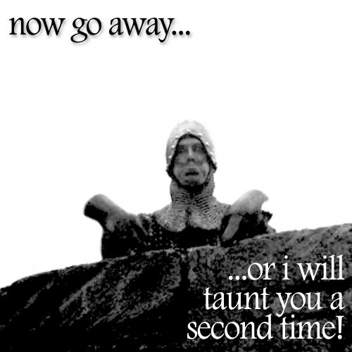

### Disclaimer

***the boring stuff***

By using this website you agree to be legally bound by these terms, which shall take effect immediately on your first use of this site. If you do not agree to be legally bound by all the following terms please do not access and/or use this site.

This disclaimer not only applies to the content posted on this website but also my content (Thomas Pollet) hosted on www.prezi.com (or the prezis (c) linked to this site).

Views expressed on these web pages, presentations (prezis (c)) or in e-mails are those of the author (Thomas Pollet), and not those of the Northumbria University (or other previous affiliations).

The author may change these terms at any time by posting changes online. Please review these terms regularly to ensure you are aware of any changes made by the author. Your continued use of this website after changes are posted, means you agree to be legally bound by these terms as they are updated and/or amended.

Every effort is made to ensure the accuracy and currency of the information contained in these pages of my web site.  However, contents are subject to change from time to time and the author can accept no liability for the accuracy of all the information presented at any given time.  The author reserves the right to make changes without notice.  Some links may lead to information maintained by third parties and the author accepts no responsibility for the accuracy or any other aspect of information obtained through such links.  Every effort is made to ensure downloadable content is free from viruses.  The author can accept no liability for damages resulting from virus infection.

In accessing the author's web pages, you agree that any downloading of content is for personal, non-commercial reference only. The key goal of this site is educational. No part of this web site may be reproduced or transmitted in any form or by any means, electronic, mechanical, photocopying, recording or otherwise, without prior explicit permission of the author, except where otherwise noted.

Every effort is made to obtain (and trace) the copyright of content on this web page (or in this presentation), if for some reason you believe a part of this website contains copyrighted material, please contact me in writing: Dr. Thomas Pollet (NB165), Northumbria University, Northumberland Building, College lane NE18ST, Newcastle upon Tyne, UK. Only requests in written format to the above mailing address will be considered. The purported copyrighted material will be removed as soon as possible (within 30 working days of the evaluation of the request). The author accepts no liability for copyright violations, and the subsequent damages, losses arising out of it, without prior explicit notification in writing for prompt removal of the copyrighted material. All legal issues concerning copyrighted material shall be dealt with by Dutch law. Please bear in mind that the majority of content is used for educational purposes and the advancement of research and science. As such a fair use policy is implied. Given that my work has been funded in the past by the Dutch Public tax payer, I also point to the [Taverne amendment](https://wetten.overheid.nl/BWBR0001886/2018-10-11/#HoofdstukIa_Artikel25fa) (Artikel 25fa van de Auteurswet).

These terms shall be governed by and interpreted in accordance with the laws of the Netherlands, as most materials were generated when I was based in the Netherlands. All judicial issues are subject to Dutch law, no other (national, international) court will deal with legal issues arising from this website or presentations (prezis(c)). (So any judicial claim, should be submitted to a Dutch court).

No rights can be deducted from the information (granted as well as submitted) on this website or the email correspondence.

#### With regard to Sustainable Development Goals (SDG) images
In line with the [guidelines](https://www.un.org/sustainabledevelopment/wp-content/uploads/2019/01/SDG_Guidelines_AUG_2019_Final.pdf), the images are used for informational use only.

#### With regard to Northumbria university email: 

This message is intended solely for the addressee and may contain confidential and/or legally privileged information. Any use, disclosure or reproduction without the sender’s explicit consent is unauthorised and may be unlawful. If you have received this message in error, please notify Northumbria University immediately and permanently delete it. Any views or opinions expressed in this message are solely those of the author and do not necessarily represent those of the University. Northumbria University email is provided by Microsoft Office365 and is hosted within the EEA, although some information may be replicated globally for backup purposes. The University cannot guarantee that this message or any attachment is virus free or has not been intercepted and/or amended.

I work flexibly, I am emailing you when as it works for me. I respect your working arrangements may be different so please respond whenever is convenient for you.    

#### With regard to AI use in my academic work

I use AI tools for my work (mostly locally Ollama with Mistral large). This is mostly for coding, writing (I am a non-native speaker). Occasionally, I also seek feedback on ideas or criticism (as I would do with a colleague). In all instances, I review its work. Where relevant, I will disclose this. Should you have queries about my use of these tools, please do contact me.

#### With regard to copyright of Northumbria University teaching materials hosted here (PY0794/PY0554).:

I herewith, assert my copyright, my teaching is my intellectual property (see the teaching page). These teaching materials have been generated via my personally owned equipment and software, therefore I establish that the exclusive copyright lies with me, rather than the university - regardless of what an employment contract states. Should the university dispute this, then please contact me as well as our [local UCU rep](https://www.ucu-unn.org.uk/) in writing, as per the terms established above.

#### EDI statement.

Equality, diversity, and inclusion matter to me. Discrimination in any form is not okay. If you’re suffering discrimination, talk to me.

---

### On a lighter note... .

By visiting this site you concur that:    
- Belgian beer and chocolate are the best in the world
- That Cobra is superior to G.I. Joe
- Sega is better than Nintendo
- That Antwerp is the by far nicer than Liverpool, Newcastle, Bruges, Louvain, Brussels (oh yes, Jolein), Ghent and obviously the entire of Germany.
-  Mia by Gorki is the best song in Dutch ever. (Yet, followed closely by the oeuvre of André Hazes).
-  If you are an academic: that I am right and you are wrong... .

{: .center-image }

