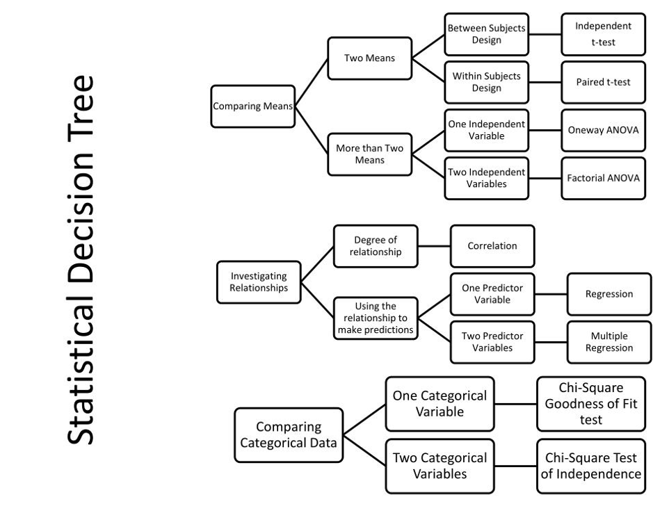

```{r, include=FALSE}
library(knitr)
opts_chunk$set(tidy.opts=list(width.cutoff=60, out.width = '.6\\linewidth'),tidy=TRUE, warning=FALSE, message=FALSE)

```

```{r setup, include=FALSE}
library(xaringanExtra)
options(htmltools.dir.version = FALSE)
knitr::opts_chunk$set(echo = TRUE)
```

```{r xaringan-tile-view, echo=FALSE}
xaringanExtra::use_tile_view()
```

## Reflecting on last week's task: the rationale

- What challenges did you have when writing the rationale?
- Did you have any successes?
- What might you do differently next time?
- What skills have you learned?
- How might you apply them to your future career?

```{r, out.width= "300px", fig.align = 'center', echo=FALSE}
knitr::include_graphics("https://i.giphy.com/media/v1.Y2lkPTc5MGI3NjExNHI4dGRxc2gwOTh6emZhMWhyY2N1Mnh0b3psbHo1bXMxb2U4MXB0ZCZlcD12MV9pbnRlcm5hbF9naWZfYnlfaWQmY3Q9Zw/l2Je4Eo5gkJtfItCE/giphy.gif")
```

---

## Peer support on rationale

- Please exchange your rationale with another person.

--

- Read their rationale and provide feedback.

--

```{r, out.width= "500px", fig.align = 'center', echo=FALSE}
knitr::include_graphics("https://i.giphy.com/media/v1.Y2lkPTc5MGI3NjExZWtldmt5YmFtOHE4aHl2cWNsYmZnbnNrcWd6cWFmMXhxNGhvbnE0eCZlcD12MV9pbnRlcm5hbF9naWZfYnlfaWQmY3Q9Zw/L5wOS2OajUQaWshcTH/giphy.gif")
```

---

## Reflection on peer support

- Were there any common issues that you both noticed?

--

- What kinds of recommendations did your peer-supporter provide?

--

- What are you going to do with the feedback?

```{r, out.width= "300px", fig.align = 'center', echo=FALSE}
knitr::include_graphics("https://i.giphy.com/media/v1.Y2lkPTc5MGI3NjExaXp0b2p3dml4aTFhZXc4eXBmdzJxZW5sZGlpeng3cTh6dnlsbzd5MiZlcD12MV9pbnRlcm5hbF9naWZfYnlfaWQmY3Q9Zw/a5viI92PAF89q/giphy.gif")
```


---

## Study Design

**Things to consider when choosing your design:**

- What design fits the hypothesis you want to test?

--

- Consider:
  - Type of study that's appropriate
  - Practicality (measurement, number of participants, analysis)
  - What type of analysis should I use to answer my research question?
  - What could be some potential problems?
  
```{r, out.width= "350px", fig.align = 'center', echo=FALSE}
knitr::include_graphics("https://i.giphy.com/media/v1.Y2lkPTc5MGI3NjExYTZzM3YyMng2eWNkNGxmaGoydnhydWl2czR0aGg5Mmg3bnB3bzFwZSZlcD12MV9pbnRlcm5hbF9naWZfYnlfaWQmY3Q9Zw/UdC6RmMXW6sRxsmtre/giphy.gif")
```

---

# Study Design (cont.)

- Spend 10 minutes discussing your design ideas with your partner

- Some of this will be easy - if you are doing a replication study: you will be doing something as close to the original!

```{r, out.width= "350px", fig.align = 'center', echo=FALSE}
knitr::include_graphics("https://i.giphy.com/media/v1.Y2lkPTc5MGI3NjExZDFnYmdmdWdsbjV3bHF4bTRncDBla3BjYnY2Y3ppZW83bGNxdGZweSZlcD12MV9pbnRlcm5hbF9naWZfYnlfaWQmY3Q9Zw/gL8jsD3ljXyyoQ10H1/giphy.gif")
```

---

# Participants

- Who do you want to recruit?

--

- How many do you think you need?

--

- How will you recruit them?

--

- Do you have a backup plan if you run into issues?


```{r, out.width= "350px", fig.align = 'center', echo=FALSE}
knitr::include_graphics("https://i.giphy.com/media/v1.Y2lkPTc5MGI3NjExanVpeW9tdGQ2a3oycjdsN3FsOTl3dWwxbjZiaXVhemZyenN1ODVmcSZlcD12MV9pbnRlcm5hbF9naWZfYnlfaWQmY3Q9Zw/5JzLvyryTfs1NGgjY8/giphy.gif")
```

---

# Interventions

- Some studies involve an intervention
  - E.g. You do some surveys, you do an hour of mindfulness, you do the surveys again.
  
--

- Does your idea involve an intervention?
  - If so, what does it look like, how is it delivered, etc.?
  - Do you think this is feasible for your project in the timeframe?


```{r, out.width= "300px", fig.align = 'center', echo=FALSE}
knitr::include_graphics("https://i.giphy.com/media/v1.Y2lkPTc5MGI3NjExdWI2aTJ3MGltdjNheXA0d205MWM4aWUxbHNndHRod2oxbTRhcnlpZyZlcD12MV9pbnRlcm5hbF9naWZfYnlfaWQmY3Q9Zw/fWx3tSeFtFGaFFjU45/giphy.gif")
```

---

# Survey measures

- Which one to pick?

  - In your literature review, is there one scale that is used by everyone (many people)?

--

  - Is it practical? (Length, language, applicability)

--

  - Can you find it online?
    - How to find an actual copy of it?
    - Is it in any of the papers which mention it?
    - Is it in any of the appendices/supplementary information?
    - What about the original article it comes from?
    - Try the [OSF](https://osf.io)
    - Try the resources provided by your module tutor
    - Literally ‘having a google’ brings up a surprising amount of resources!

```{r, out.width= "200px", fig.align = 'center', echo=FALSE}
knitr::include_graphics("https://i.giphy.com/media/v1.Y2lkPTc5MGI3NjExdTNpOTIzcWY4bjJxM3lyOGVxeGlwbWkzNmtwdzhnOXRqYjB5dGtyMCZlcD12MV9pbnRlcm5hbF9naWZfYnlfaWQmY3Q9Zw/3o6fIZP7rywPQyEV44/giphy.gif")
```

---

# Designing items

- We would only do this if there’s nothing close which is ‘good enough’.
- But, sometimes you just need to ask about one thing or there's no scale for what you're interested in
- Things to consider:
  - Is it easy to read/understand by my target audience
  - What type of response options should I use?
  - What type of data will this question give me
  - More importantly, can I analyse it?


---

# Other measures

- Some studies involve other measures
  - E.g. a reaction time task, a reading task, a driving simulator

--

- If you are using one of these, does it exist already?

--

- If it is new, what is it going to look like/how are you going to create it?

--

- What sort of data does this produce and how will you analyse it?

---

# Procedure

- Have a clear idea what will happen in your study

--

- You need to know everything both the researcher and participant is required to do

--

- Set this out as a timeline with at least two columns: participant/researcher

```{r, out.width= "275px", fig.align = 'center', echo=FALSE}
knitr::include_graphics("https://i.giphy.com/media/v1.Y2lkPTc5MGI3NjExbTR6b3g0M2o3OTZxN2pzMjlndnd1bWZrbG1mNGhnNDBtajBkaXhpNCZlcD12MV9pbnRlcm5hbF9naWZfYnlfaWQmY3Q9Zw/rjfJRFnJS153ehlwCW/giphy.gif")
```


---

# Analysing your data

**Again, easier if you are doing a replication project!**


- Before you start doing anything have a good idea about what the data and analysis will look like

--

- Before collecting data you must know what to do with it
  - E.g. you know you need to run a regression and you know how to turn a spreadsheet of raw data into a readable output which you can report from

--

- Next page has a helpful flow chart to help identify an analysis

--

- This is a good general overview, but you need to know how your data will work in reality

```{r, out.width= "200px", fig.align = 'center', echo=FALSE}
knitr::include_graphics("https://i.giphy.com/media/v1.Y2lkPTc5MGI3NjExNnFtYTA4eGtrd3Mwd2F0emk5enQ0dTVuNDV0ZjM1ZmRvYWkxZGNpNSZlcD12MV9pbnRlcm5hbF9naWZfYnlfaWQmY3Q9Zw/xT9C25UNTwfZuk85WP/giphy.gif")
```


---
## (Grossly oversimplified) Statistical decision tree

```{r, out.width= "700px", fig.align = 'center', echo=FALSE}

```

---

# Ethical considerations

- What ethical considerations do you have?

--

- We recommend avoiding high risk studies as the ethics process is longer and can hold you up

--

- We can talk through this and see how we reduce the ethical risk

--

- Some groups automatically are high risk (e.g. children) or people with specific diagnoses

```{r, out.width= "250px", fig.align = 'center', echo=FALSE}
knitr::include_graphics("https://i.giphy.com/media/v1.Y2lkPTc5MGI3NjExdjJqM25ocHN5b3BhMXc0eG9qZXY3dml0OXlxMjRlMnRtNjJsc3huaCZlcD12MV9pbnRlcm5hbF9naWZfYnlfaWQmY3Q9Zw/d7NPZwPzxSpFUjb2mi/giphy-downsized-large.gif")
```

---

# It's your turn!

- Work with your partner to design your study, find measures, and decide which analysis to use.

```{r, out.width= "400px", fig.align = 'center', echo=FALSE}
knitr::include_graphics("https://i.giphy.com/media/v1.Y2lkPTc5MGI3NjExaHZmOTA1czEwOWFxc3o0YmE0d3BoaDhhaGVwZDIydWdvc2c3eW9mdyZlcD12MV9pbnRlcm5hbF9naWZfYnlfaWQmY3Q9Zw/TKNGghpLhaz9XH1tSj/giphy.gif")
```

---

# For next time…

- Bring a clear design for your project

--

- We will use this to start the ethics form next week - but you can already start this!

```{r, out.width= "500px", fig.align = 'center', echo=FALSE}
knitr::include_graphics("https://i.giphy.com/media/v1.Y2lkPTc5MGI3NjExZ3lwcnYyN3ZldGJlODRhZXpoNHd4MG56aWEwMGFtb216aHFlZW54MiZlcD12MV9pbnRlcm5hbF9naWZfYnlfaWQmY3Q9Zw/zDpYQooxkwXkAWMxRK/giphy.gif")
```


---
## References (and further reading.)

* Cohen, L., Manion, L., & Morrison, K. (2018). *Research methods in education* (8th ed.). Routledge
* Coolican, H. (2019). *Research methods and statistics in psychology* (7th ed.). Routledge.
* Creswell, J. W., & Creswell, J. D. (2018). *Research design: Qualitative, quantitative, and mixed methods approaches* (5th ed.). SAGE Publications.

[https://tvpollet.github.io/thesis_projects/](https://tvpollet.github.io/thesis_projects/)


